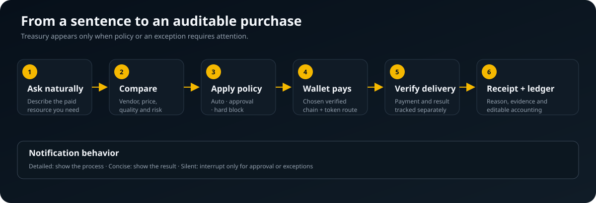
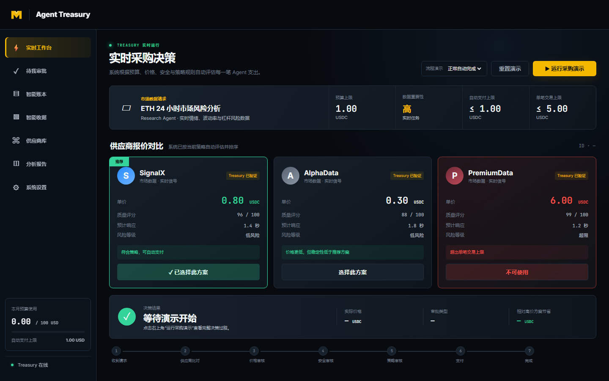
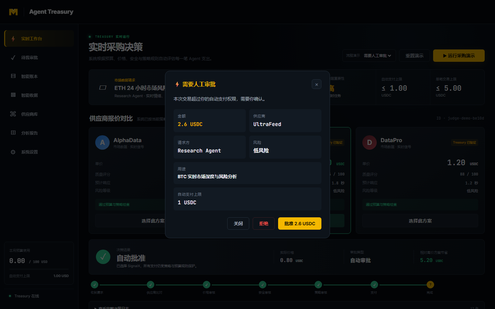
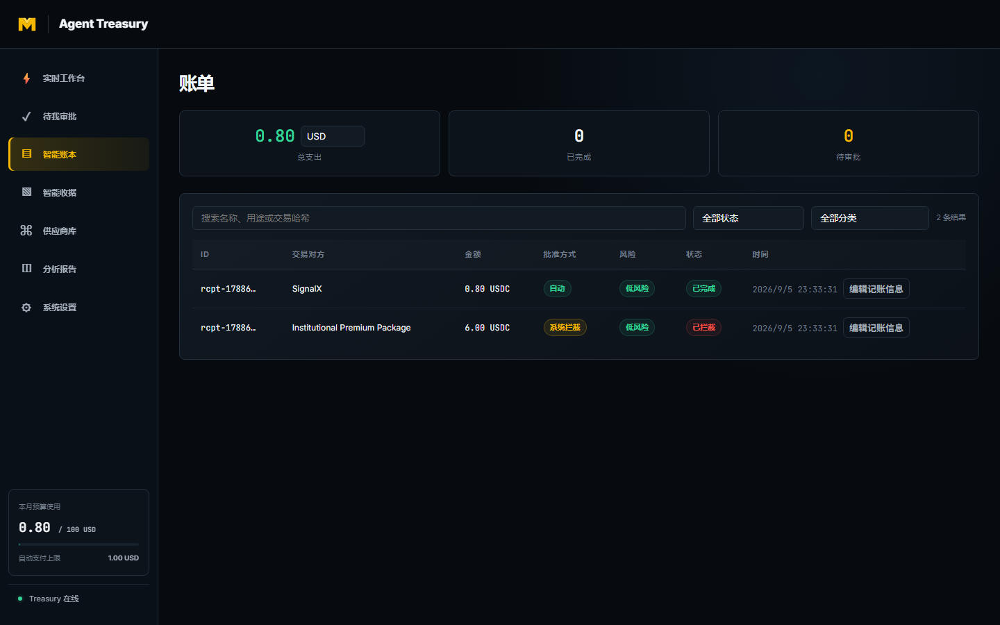
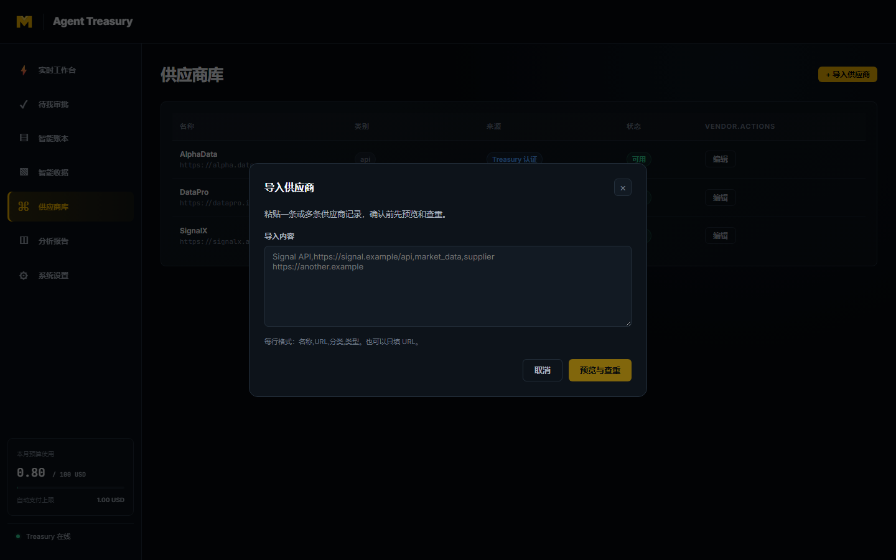
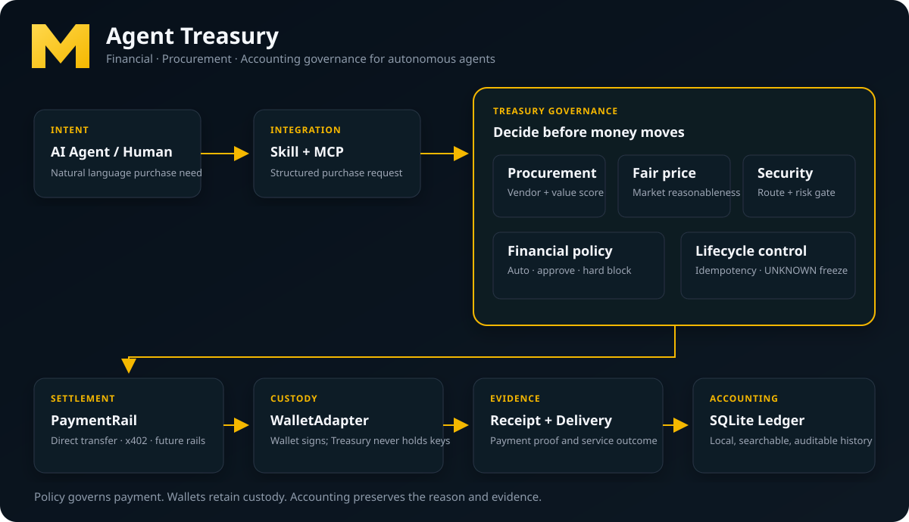

<p align="center"></p>

<h1 align="center">Agent Treasury</h1>

<p align="center"><strong>面向自主 AI Agent 的財務、採購與會計治理層。</strong></p>

<p align="center"><a href="README.zh-CN.md">简体中文</a> · 繁體中文 · <a href="README.md">English</a></p>

> AI Agent 已經知道如何支付，Agent Treasury 決定它是否應該支付。

Agent Treasury 不是錢包，也不只服務於 x402。它位於 AI Agent 與付費資源之間，管理供應商選擇、價值、風險、審批、結算、收據與帳務。錢包繼續保管資產並完成簽名，Treasury 負責財務控制與可稽核記錄。

## 為什麼需要它

錢包解決如何轉移資產，但不會判斷 Agent 是否應該花費、供應商是否可靠、價格是否合理，也不會保存完整的採購理由。Treasury 將權限、採購、支付與會計連接起來，並在首次設定規則後盡量減少打擾。

## 三個核心角色

| 角色 | 解決的問題 |
|---|---|
| 財務總監 | 能不能花、可以花多少？ |
| 採購經理 | 應該向誰買、價格是否合理？ |
| 會計系統 | 錢花到哪裡、為什麼花、證據在哪？ |

人的策略永遠優先。品質優先、平衡、價格優先只改變合規方案的排序，不能繞過安全檢查、審批門檻與硬性預算上限。

## 如何使用

使用者在已接入的 AI 中用自然語言提出需求，Treasury 會比較供應商、執行策略、在需要時要求審批、委託錢包付款，最後驗證交付並記帳。



詳細模式展示過程，簡潔模式只顯示結果，靜默模式只在需要審批或發生異常時打擾。目前網頁內通知已完成；跨 AI 宿主的系統級通知尚未完成。

## 產品實機畫面

| 即時採購工作台 | 人工審批卡 |
|---|---|
|  |  |
| 智慧帳本 | 供應商匯入 |
|  |  |

倉庫內共有十張可重複產生的真實頁面截圖，涵蓋首次設定、自動完成、人工審批、異常阻斷、帳本、收據、策略、供應商匯入與完整英文介面。執行 `npm run screenshot` 會使用隔離的模擬資料庫重新產生，不會接觸使用者的真實資料庫或啟用真實支付。

## 當前能力

- Agent Skill 與 MCP 的 AI 宿主接入。
- 三種採購偏好，以及自動支付、人工審批、單筆、每日和每月邊界。
- 供應商評分、公允價格、安全審查、支付狀態、收據與帳本完整生命週期。
- SQLite 本地持久化、可稽核會計分類與不可變交易事實。
- 供應商匯入預覽、去重、名稱編輯、部分結果與單次復原。
- 自然語言查帳，以及月度、年度和全部帳期分析。
- WalletAdapter、PaymentRail 與多鏈、多幣種路線聲明。
- 預設模擬支付；已驗證一次受控 BSC-USDT 真實支付證明。
- 簡體中文與英文操作介面。



## 本機體驗

需要 Node.js 22 與 npm：

```bash
git clone https://github.com/menghaoran214-lang/agent-treasury.git
cd agent-treasury
npm install
npm run ui:build
npm run service
```

開啟 `http://127.0.0.1:3333`。預設為 `mock`，不會發起真實轉帳。完整驗證使用 `npm run test:all`。

## 當前支援範圍

模擬支付與 BSC-USDT 直接轉帳證明已完成。多鏈與多幣種模型已具備，但每條真實路線仍需獨立驗證。OKX 等其他錢包、x402、訂閱支付、系統級通知與一鍵安裝尚未完成。

## 安全與產品化狀態

Treasury 不接收助記詞或私鑰；簽名留在錢包中。只有策略允許且已驗證的路線可以執行，UNKNOWN 支付會凍結並等待人工核查，絕不自動重試。

自動識別 AI 宿主、安裝 Skill、註冊 MCP、開機啟動、修復、升級與解除安裝尚未完成，因此目前不能稱為「一鍵安裝」。

詳細進度見 [`PROJECT_STATUS.md`](PROJECT_STATUS.md) 與 [`docs/07-PRODUCT-V2-ROADMAP.md`](docs/07-PRODUCT-V2-ROADMAP.md)。

## Roadmap 與貢獻

下一階段依序是後台服務生命週期、AI 宿主自動註冊、一鍵安裝、乾淨電腦驗收、簽名發佈與升級回滾。現階段歡迎可重現問題、文件修正和不包含憑證的測試報告；請勿提交 `.env`、資料庫、日誌、錢包工作階段或密鑰。貢獻規則見 [`CONTRIBUTING.md`](CONTRIBUTING.md)，敏感問題請依照 [`SECURITY.md`](SECURITY.md) 私下報告。

## 聯絡方式

問題與建議：[X @menghaoran214](https://x.com/menghaoran214)。

## 授權

專案尚未聲明公開授權條款；在正式加入授權以前保留全部權利。
